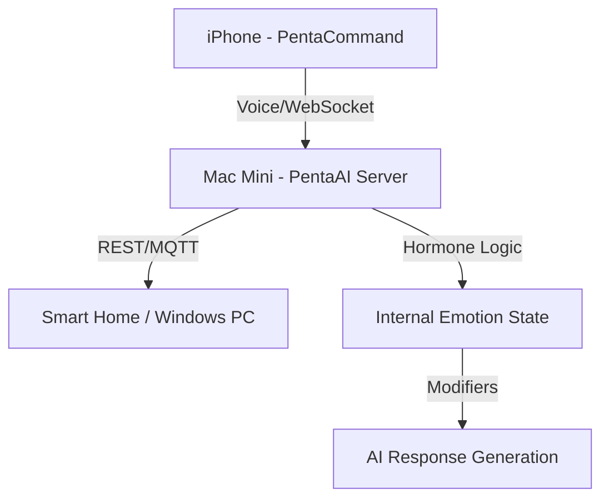

# 🔺 pentaKURUMI: Unified AI Ecosystem


**pentaKURUMI** là một hệ sinh thái AI toàn diện, kết hợp giữa máy chủ trí tuệ nhân tạo (Mac Mini) và ứng dụng điều khiển giọng nói (iOS). Điểm đặc biệt của hệ thống là **Hormone System v2.0** mô phỏng sinh học, giúp AI có cảm xúc, tính cách và trực giác như con người.

---

## 🧠 Tính năng cốt lõi

### 1. Hệ thống Hormone v2.0 (Biological Interior)
Hệ thống cảm xúc được xây dựng dựa trên 7 loại hormone và chất dẫn truyền thần kinh:
- **Dopamine**: Tò mò, hưng phấn, ham học hỏi.
- **Serotonin**: Hài lòng, bình ổn, tự tin.
- **Oxytocin**: Gắn bó, tin tưởng, ấm áp (tăng khi gọi "anh/em").
- **Cortisol**: Căng thẳng, lo lắng, phòng thủ.
- **Adrenaline**: Bất ngờ, kích thích phản ứng nhanh.
- **GABA**: Làm dịu, trấn tĩnh hệ thống.
- **Norepinephrine**: Tập trung, cảnh giác.

### 2. Trực giác & Ký ức (Intuition & Memory)
- **Episodic Memory**: AI có khả năng "nhớ" lại cảm xúc của các cuộc trò chuyện cũ thông qua vector search.
- **Semantic Learning**: Tự học từ mới và gán giá trị cảm xúc dựa trên ngữ nghĩa (hỗ trợ VI/EN/JP).
- **Temperament (Tính khí)**: AI được thiết lập tính khí bẩm sinh (Nhạy cảm, Mạnh mẽ, Hướng nội...) ảnh hưởng đến cách phản ứng với thế giới.

### 3. Phản hồi chủ động (Proactive Engine)
AI không chỉ chờ lệnh mà có thể **tự bộc lộ cảm xúc** (ví dụ: "Em hơi mệt...", "Nói chuyện với anh vui quá!") khi các chỉ số hormone vượt ngưỡng.

---

## 🏗️ Kiến trúc hệ thống



---

## 📂 Cấu trúc dự án

### 1. [PentaAI_Mac](./PentaAI_Mac)
Máy chủ AI chạy trên Python/FastAPI, xử lý:
- **Hormone Engine**: Lõi điều khiển cảm xúc.
- **NLP & Intent**: Nhận diện ý định và ngữ cảnh câu nói.
- **TTS Engine**: Tích hợp Voicevox (JP) và Valtec (VI) cho giọng nói tự nhiên.
- **Ollama Client**: Xử lý các lệnh thông minh qua local LLM.

### 2. [PentaCommand](./PentaCommand)
Ứng dụng iOS (SwiftUI) giúp tương tác:
- **Voice Recognition**: Chuyển giọng nói thành văn bản thời gian thực.
- **WebSocket**: Kết nối độ trễ thấp với máy chủ AI.
- **UI Metrics**: Hiển thị trạng thái cảm xúc của AI qua Emoji và màu sắc.

---

## 🚀 Hướng dẫn cài đặt nhanh

### Yêu cầu
- **Phần cứng**: Mac Mini (hoặc Mac bất kỳ) chạy server, iPhone để cài client.
- **Phần mềm**: Python 3.10+, Xcode 15+, Tailscale (để kết nối từ xa).

### Chạy Server
```bash
cd PentaAI_Mac
pip install -r requirements.txt
python ai_server.py
```

### Cài đặt Client
1. Mở `PentaCommand.xcodeproj` bằng Xcode.
2. Cấu hình IP Tailscale của Mac Mini trong mục **Settings** của App.
3. Build và chạy trên iPhone.

---

## 🛡️ Bảo mật & Riêng tư
- Mọi dữ liệu hormone, cấu hình và ký ức được lưu trữ **cục bộ (Local Only)** trên Mac của bạn.
- Tệp `.gitignore` đã được thiết lập để không đưa các thông tin cá nhân này lên GitHub.

---

## ❤️ Đóng góp
Dự án được phát triển bởi **gooleseswsq1**. Mọi ý kiến đóng góp về hệ thống hormone hoặc cải thiện giọng nói đều được chào đón!

---
*Created with love for a More Human AI.*
